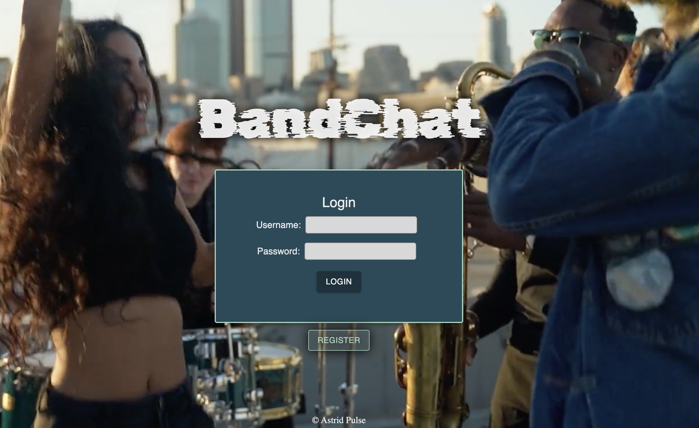
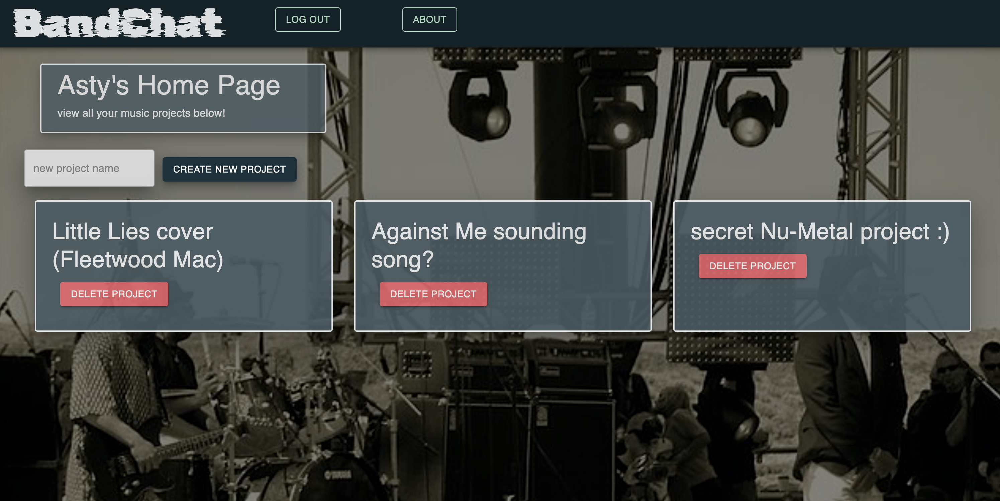

# Bandchat

BandChat is a Javascript web app where musicians can collaborate on a project in a shared workspace, divided up by instrument part.

## Installation

prereqs for running  are:
Node.js
PostgreSQL

using node package manager, run `npm install` 

Create Postgres database:
`bandchat_db` and run the SQL found in the database.sql file to create needed tables

## Tech Stack

Server and Client side made with Javascript

**Client:** React, Redux, Saga, Axios

**Server:** Node, Express

**APIs:** 
- Multer [https://www.npmjs.com/package/multer]
- RecorderJs [https://www.npmjs.com/package/recorder-js] 

## Screenshots

Home page. 
Login or register to enter the site. 
Note: Any manual entries of url to the webpage bar will redirect to home page if not logged in

All Projects page.
From here, a logged in user can create new "projects" (songs, compositions, general musical notes and musings)

Clicking on the title of the project card will bring the user to the Project Workspace

